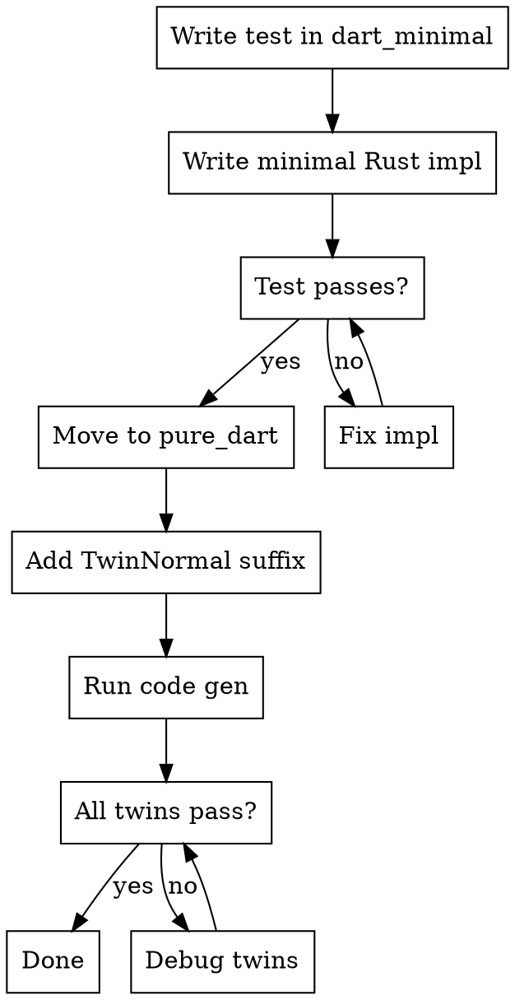

# FRB Develop Feature

## Overview

**TDD workflow for flutter_rust_bridge features: start in dart_minimal (fast compile), migrate to pure_dart (full coverage).**

Core principle: Use dart_minimal for rapid iteration during RED-GREEN cycle, then move tests to pure_dart for comprehensive twin test generation.

## When to Use

- Adding a new function or feature
- Writing tests for new or existing functionality
- Compilation feels slow (use dart_minimal instead)
- Need to debug code generation behavior

## TDD Workflow



### Phase 1: RED (in dart_minimal)

1. **Write failing test first:**
   - Rust: `frb_example/dart_minimal/rust/src/api/my_feature.rs`
   - Dart: `frb_example/dart_minimal/dart/lib/my_feature_test.dart`

2. **Run test - expect failure:**
   ```bash
   cd frb_example/dart_minimal
   ./gradlew assemble  # or flutter build
   dart test
   ```

### Phase 2: GREEN (in dart_minimal)

1. **Write minimal Rust implementation** to pass the test

2. **Run code generation:**
   ```bash
   ./frb_internal precommit-generate
   ```

3. **Verify test passes:**
   ```bash
   cd frb_example/dart_minimal
   dart test
   ```

### Phase 3: MIGRATE (to pure_dart)

1. **Move test files to pure_dart:**
   - From: `dart_minimal/rust/src/api/my_feature.rs`
   - To: `pure_dart/rust/src/api/my_feature.rs`
   - From: `dart_minimal/dart/lib/my_feature_test.dart`
   - To: `pure_dart/test/api/my_feature_test.dart`

2. **Add TwinNormal suffix** to all functions and types:

   | Context | Suffix | Example |
   |---------|--------|---------|
   | snake_case (functions) | `_twin_normal` | `my_func_twin_normal()` |
   | PascalCase (types) | `TwinNormal` | `MyStructTwinNormal` |

3. **Run code generation:**
   ```bash
   ./frb_internal precommit-generate
   ```

4. **Run all tests:**
   ```bash
   cd frb_example/pure_dart
   dart test
   ```

## Why This Workflow?

| Phase | Location | Why |
|-------|----------|-----|
| RED | dart_minimal | Fast compile = quick feedback on test design |
| GREEN | dart_minimal | Minimal deps = faster iteration |
| Final | pure_dart | Twin tests = automatic coverage of all codegen modes |

**Write one test → get ~6 variants automatically** via twin naming convention.

## Twin Naming Convention

The `TwinNormal` suffix triggers automatic test generation:

- Internal scripts create "twin" tests
- Same logic runs under different codegen modes
- Covers: with/without Dart snapshot, different crate types

**Always mimic existing pure_dart tests** for exact patterns.

## Quick Reference

| Task | Location | Command |
|------|----------|---------|
| Quick iteration | `frb_example/dart_minimal` | `dart test` |
| Full test suite | `frb_example/pure_dart` | `dart test` |
| Code generation | repo root | `./frb_internal precommit-generate` |
| Debug dumps | `rust/target/frb_dump/` | Set `dump_all: true` |

## Debug Code Generation

When generated code looks wrong:

1. Enable dumping in `flutter_rust_bridge.yaml`:
   ```yaml
   dump_all: true
   ```

2. Run code generation

3. Inspect `rust/target/frb_dump/` for intermediate representations

## Common Mistakes

| Mistake | Fix |
|---------|-----|
| Skipping dart_minimal phase | Start there - saves time on compilation |
| Forgetting TwinNormal suffix | Add before code gen in pure_dart |
| Moving test without updating imports | Check import paths after migration |
| Not running code gen after move | Always run `./frb_internal precommit-generate` |

## Related Skills

- `frb-code-generation` - Which generation commands to run
- `frb-test` - How to run tests locally
- `frb-prepare-pr` - Preparing a PR for review
