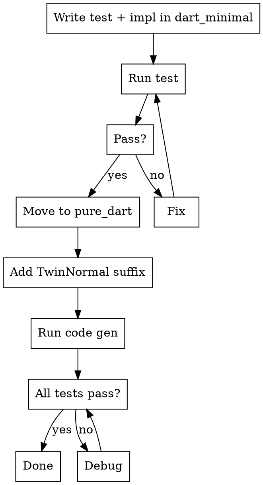

# FRB Develop Feature

## Overview

**Iterate in dart_minimal (fast compile), migrate to pure_dart (full coverage).**

Core principle: Use dart_minimal for rapid development, then move tests to pure_dart for comprehensive twin test generation.

## When to Use

- Adding a new function or feature
- Writing tests for new or existing functionality
- Compilation feels slow (use dart_minimal instead)

## Workflow



### Phase 1: Iterate in dart_minimal

1. **Add test and implementation to existing files:**
   - Rust: add function to `frb_example/dart_minimal/rust/src/api/minimal.rs`
   - Dart: add test to `frb_example/dart_minimal/test/minimal_test.dart`

   Don't create new files - keep it minimal.

2. **Run test:**
   ```bash
   ./frb_internal test-dart-native --package frb_example/dart_minimal
   ```

3. **Iterate until test passes**

### Phase 2: MIGRATE (to pure_dart)

1. **Copy code to pure_dart (create new files there):**
   - Rust: `pure_dart/rust/src/api/my_feature.rs`
   - Dart: `pure_dart/test/api/my_feature_test.dart`

   Then remove from dart_minimal files.

2. **Add TwinNormal suffix** to all functions and types:

   | Context | Suffix | Example |
   |---------|--------|---------|
   | snake_case (functions) | `_twin_normal` | `my_func_twin_normal()` |
   | PascalCase (types) | `TwinNormal` | `MyStructTwinNormal` |

3. **Run code generation:**
   ```bash
   ./frb_internal precommit-generate
   ```

4. **Run all tests in both pure_dart and pure_dart_pde:**
   ```bash
   ./frb_internal test-dart-native --package frb_example/pure_dart
   ./frb_internal test-dart-native --package frb_example/pure_dart_pde
   ```

   Both must pass - they test different codegen configurations.

## Why This Workflow?

| Phase | Location | Why |
|-------|----------|-----|
| Iterate | dart_minimal | Fast compile = quick feedback |
| Migrate | pure_dart + pure_dart_pde | Twin tests = automatic coverage of all codegen modes |

**Write one test → get ~6 variants automatically** via twin naming convention.

## Twin Naming Convention

The `TwinNormal` suffix triggers automatic test generation:

- Internal scripts create "twin" tests
- Same logic runs under different codegen modes
- Covers: with/without Dart snapshot, different crate types

**Always mimic existing pure_dart tests** for exact patterns.

## Quick Reference

| Task | Command |
|------|---------|
| Test dart_minimal | `./frb_internal test-dart-native --package frb_example/dart_minimal` |
| Test pure_dart | `./frb_internal test-dart-native --package frb_example/pure_dart` |
| Test pure_dart_pde | `./frb_internal test-dart-native --package frb_example/pure_dart_pde` |
| Code generation | `./frb_internal precommit-generate` |

## Common Mistakes

| Mistake | Fix |
|---------|-----|
| Skipping dart_minimal phase | Start there - saves time on compilation |
| Forgetting TwinNormal suffix | Add before code gen in pure_dart |
| Moving test without updating imports | Check import paths after migration |
| Not running code gen after move | Always run `./frb_internal precommit-generate` |

## Related Skills

- `frb-code-generation` - Which generation commands to run
- `frb-test` - How to run tests locally
- `frb-debugging` - Debug code generation issues
- `frb-prepare-pr` - Preparing a PR for review
