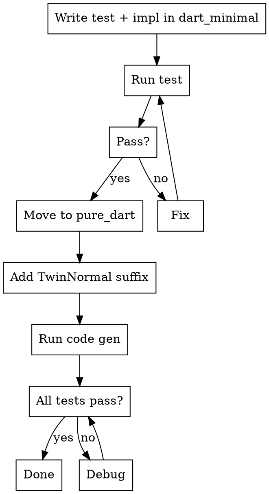

# FRB Develop Feature

## Overview

**Iterate in frb_example/dart_minimal (fast compile), migrate to frb_example/pure_dart (full coverage).**

| Phase | Location | Why |
|-------|----------|-----|
| Iterate | frb_example/dart_minimal | Fast compile = quick feedback |
| Migrate | frb_example/pure_dart + pure_dart_pde | Twin tests = automatic coverage of all codegen modes |

Write one test → get ~6 variants automatically via TwinNormal suffix.

## When to Use

- Adding a new function or feature
- Writing tests for new or existing functionality
- Compilation feels slow (use frb_example/dart_minimal instead)

## Implementation



### Phase 1: Iterate in frb_example/dart_minimal

1. **Add tests:**
   - Rust: add function to `frb_example/dart_minimal/rust/src/api/minimal.rs`
   - Dart: add test to `frb_example/dart_minimal/test/minimal_test.dart`

   There is usually no need to create any new files.

2. **Add implementations:**

   Usually need to modify `frb_codegen`, `frb_dart`, and/or `frb_rust`.

3. **Run codegen and test:**
   ```bash
   (cd frb_example/dart_minimal && cargo run --manifest-path ../../frb_codegen/Cargo.toml -- generate)
   ./frb_internal test-dart-native --package frb_example/dart_minimal
   ```

4. **Iterate until test passes**

### Phase 2: Migrate to frb_example/pure_dart

1. **Move code to frb_example/pure_dart:**
   - Rust: `frb_example/pure_dart/rust/src/api/my_feature.rs`
   - Dart: `frb_example/pure_dart/test/api/my_feature_test.dart`

   Either add to existing files or create new files. Then remove from frb_example/dart_minimal files.

2. **Add TwinNormal suffix** to all functions and types:

   | Context | Suffix | Example |
   |---------|--------|---------|
   | snake_case | `_twin_normal` | `my_func_twin_normal()` |
   | PascalCase | `TwinNormal` | `MyStructTwinNormal` |

   This triggers automatic test generation (~6 variants) under different codegen modes. Always mimic existing frb_example/pure_dart tests for exact patterns.

3. **Run codegen and test:**
   ```bash
   # Codegen
   ./frb_internal precommit-generate

   # Test (can run in parallel)
   ./frb_internal test-dart-native --package frb_example/pure_dart
   ./frb_internal test-dart-native --package frb_example/pure_dart_pde
   ```

   Both must pass - they test different codegen configurations.

4. **Iterate until test passes**

   You may use frb_example/dart_minimal again if there are bugs and need fast iteration.

## Quick Reference

### Tasks and Commands

| Task | Command |
|------|---------|
| Test dart_minimal | `./frb_internal test-dart-native --package frb_example/dart_minimal` |
| Test pure_dart | `./frb_internal test-dart-native --package frb_example/pure_dart` |
| Test pure_dart_pde | `./frb_internal test-dart-native --package frb_example/pure_dart_pde` |
| Code generation | `./frb_internal precommit-generate` |

### Architecture

- **Doc:** `website/docs/guides/contributing/overview.md` - System architecture, codegen flow, directory structure
- **Key directories:**
  | Directory | Purpose |
  |-----------|---------|
  | `frb_codegen/` | Code generator (IR → Rust/Dart output) |
  | `frb_dart/` | Dart runtime library |
  | `frb_rust/` | Rust runtime library |
  | `frb_example/` | Examples + tests (`pure_dart` has most coverage) |

## Common Mistakes

| Mistake | Fix |
|---------|-----|
| Skipping frb_example/dart_minimal phase | Start there - saves time on compilation |
| Forgetting TwinNormal suffix | Add before code gen in frb_example/pure_dart |
| Moving test without updating imports | Check import paths after migration |
| Not running code gen after move | Always run `./frb_internal precommit-generate` |

## Related Skills

- `frb-code-generation` - Which generation commands to run
- `frb-test` - How to run tests locally
- `frb-debugging` - Debug code generation issues
- `frb-prepare-pr` - Preparing a PR for review
