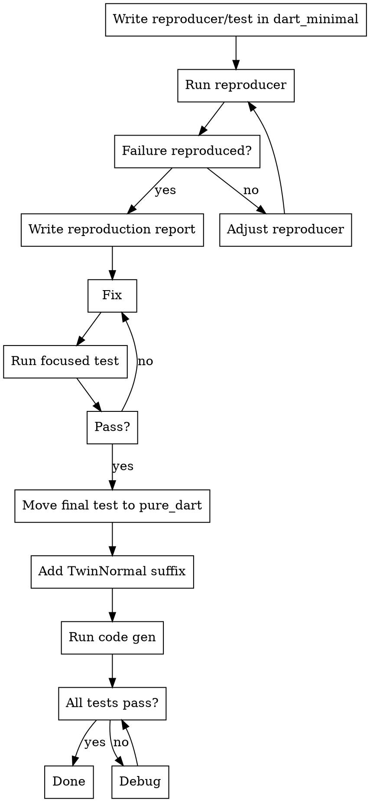

# FRB Develop Feature or Bug Fix

> **Note:** Check your user-level `remote-testing` rules before running commands. Tests and codegen may require remote execution.

## Overview

**For both bug fixes and new features: iterate in `frb_example/dart_minimal` (fast compile), then migrate the final test to `frb_example/pure_dart` (full coverage).**

`dart_minimal` is only an iteration workspace. A bug fix or feature PR is not ready when its only regression coverage lives in `dart_minimal`; stop before PR preparation and move the final test to `pure_dart`/`pure_dart_pde`.

| Phase | Location | Why |
|-------|----------|-----|
| Reproduce / Iterate | frb_example/dart_minimal | Fast compile = quick feedback |
| Migrate final regression / feature test | frb_example/pure_dart + pure_dart_pde | Twin tests = automatic coverage of all codegen modes |

For bugs, first make the failure reproducible in `dart_minimal`, write down the exact reproduction report, fix it there, and only then move the regression test to `pure_dart`. For features, follow the same fast-iteration loop before adding the final `pure_dart` coverage.

Write one final test → get ~6 variants automatically via TwinNormal suffix.

## Final Placement Gate

Before pushing, opening a PR, requesting review, or monitoring CI as if the work is ready:

- Confirm every final regression or feature test has been moved from `frb_example/dart_minimal` to `frb_example/pure_dart`.
- Confirm the final Rust APIs/types/functions in `pure_dart` use the `TwinNormal` suffix pattern where applicable.
- Confirm code generation has produced the matching `pure_dart_pde` coverage.
- For feature flags whose enabled and disabled behavior both need coverage, confirm the flag is exposed in `flutter_rust_bridge.yaml` and the command-line interface, and prefer adding an item-level `#[frb(...)]` override when feasible.
- For such feature flags, prefer `pure_dart` tests that use the `#[frb(...)]` override so enabled and disabled cases are both exercised in the same package.
- Remove the temporary `dart_minimal` reproducer unless it is intentionally kept as a minimal example in addition to the `pure_dart` regression.

If any of these checks fail, return to Phase 2. Do not treat a passing `dart_minimal` test as final readiness.

## When to Use

- Fixing a bug that should get a regression test
- Adding a new function or feature
- Writing tests for new or existing functionality
- Compilation feels slow (use frb_example/dart_minimal instead)

## Bug Fix Reproduction Report

For every bug fix, the PR description must include a reproduction report before the fix is presented as convincing.

Capture the report immediately after reproducing the bug and before changing the fix code. It must include:

- **Baseline commit:** the exact commit hash, pushed and accessible to reviewers, used to reproduce the bug
- **Mechanical steps:** copy-pasteable commands or file edits, using code blocks for multi-line changes, that reproduce the bug from that commit
- **Observed failure:** the concrete failing command, error message, panic, assertion, or incorrect output
- **Expected behavior:** the behavior that should happen after the fix

Use this PR description shape:

````markdown
## Reproduction

Baseline commit: `<commit-hash>`

Steps:
1. `<command or edit>`
2. `<command>`

Observed:
```text
<error output>
```

Expected:
<expected behavior>
````

If the reproduction needs temporary test code in `frb_example/dart_minimal`, describe the exact temporary Rust/Dart edits in the steps. Keep the temporary reproducer only while debugging, then migrate the final regression test to `frb_example/pure_dart`.

## Implementation


```dot
digraph workflow {
    rankdir=TB;
    node [shape=box];

    "Write reproducer/test in dart_minimal" -> "Run reproducer";
    "Run reproducer" -> "Failure reproduced?" [shape=diamond];
    "Failure reproduced?" -> "Write reproduction report" [label="yes"];
    "Failure reproduced?" -> "Adjust reproducer" [label="no"];
    "Adjust reproducer" -> "Run reproducer";
    "Write reproduction report" -> "Fix";
    "Fix" -> "Run focused test";
    "Run focused test" -> "Pass?" [shape=diamond];
    "Pass?" -> "Move final test to pure_dart" [label="yes"];
    "Pass?" -> "Fix" [label="no"];
    "Move final test to pure_dart" -> "Add TwinNormal suffix" -> "Run code gen" -> "All tests pass?";
    "All tests pass?" -> "Done" [label="yes"];
    "All tests pass?" -> "Debug" [label="no"];
    "Debug" -> "All tests pass?";
}
```

### Phase 1: Iterate in frb_example/dart_minimal

1. **Add the smallest test or bug reproducer:**
   - Rust: add function to `frb_example/dart_minimal/rust/src/api/minimal.rs`
   - Dart: add test to `frb_example/dart_minimal/test/minimal_test.dart`

   For bug fixes, this test should fail before the fix and pass after the fix. There is usually no need to create any new files.

2. **Run the reproducer and record the reproduction report:**

   Before changing the fix code, save the baseline commit hash, exact commands or temporary edits, and the observed failure output. This report must go into the PR description.

3. **Add the implementation or fix:**

   Usually need to modify `frb_codegen`, `frb_dart`, and/or `frb_rust`.

4. **Run codegen and test:**
   ```bash
   (cd frb_example/dart_minimal && cargo run --manifest-path ../../frb_codegen/Cargo.toml -- generate)
   ./frb_internal test-dart-native --package frb_example/dart_minimal
   ```

   > **After codegen:** Check your user-level `remote-testing` rules. If codegen was run remotely, pull changes back to local.

5. **Iterate until test passes**

   Keep the temporary `dart_minimal` reproducer while debugging. Passing here only proves the fix is ready to migrate; it is not the final regression placement. Remove or simplify the temporary reproducer after the final regression test has been migrated to `pure_dart`.

### Phase 2: Migrate to frb_example/pure_dart

1. **Move the final feature or regression test to frb_example/pure_dart:**
   - Rust: `frb_example/pure_dart/rust/src/api/my_feature.rs`
   - Dart: `frb_example/pure_dart/test/api/my_feature_test.dart`

   Either add to existing files or create new files. Then remove temporary reproducer code from `frb_example/dart_minimal` unless it is intentionally useful as a minimal example.

2. **Add TwinNormal suffix** to all functions and types:

   | Context | Suffix | Example |
   |---------|--------|---------|
   | snake_case | `_twin_normal` | `my_func_twin_normal()` |
   | PascalCase | `TwinNormal` | `MyStructTwinNormal` |

   This triggers automatic test generation (~6 variants) under different codegen modes. Always mimic existing frb_example/pure_dart tests for exact patterns.

3. **Run codegen and test:**
   ```bash
   # Codegen
   ./frb_internal precommit-generate

   # Native tests (can run in parallel)
   ./frb_internal test-dart-native --package frb_example/pure_dart
   ./frb_internal test-dart-native --package frb_example/pure_dart_pde

   # Web tests (optional, for web platform coverage)
   ./frb_internal test-dart-web --package frb_example/pure_dart
   ./frb_internal test-dart-web --package frb_example/pure_dart_pde
   ```

   > **After codegen:** Check your user-level `remote-testing` rules. If codegen was run remotely, pull changes back to local.

   Native tests must pass - they test different codegen configurations. Web tests are optional but recommended for web platform coverage.

4. **Iterate until test passes**

   You may use frb_example/dart_minimal again if there are bugs and need fast iteration.

## Quick Reference

### Tasks and Commands

| Task | Command |
|------|---------|
| Test dart_minimal | `./frb_internal test-dart-native --package frb_example/dart_minimal` |
| Test pure_dart | `./frb_internal test-dart-native --package frb_example/pure_dart` |
| Test pure_dart_pde | `./frb_internal test-dart-native --package frb_example/pure_dart_pde` |
| Web test pure_dart | `./frb_internal test-dart-web --package frb_example/pure_dart` |
| Web test pure_dart_pde | `./frb_internal test-dart-web --package frb_example/pure_dart_pde` |
| Code generation | `./frb_internal precommit-generate` |

### Architecture

- **Doc:** `website/docs/guides/contributing/overview.md` - System architecture, codegen flow, directory structure
- **Key directories:**
  | Directory | Purpose |
  |-----------|---------|
  | `frb_codegen/` | Code generator (IR → Rust/Dart output) |
  | `frb_dart/` | Dart runtime library |
  | `frb_rust/` | Rust runtime library |
  | `frb_example/` | Examples + tests (`pure_dart` has most coverage) |

## Common Mistakes

| Mistake | Fix |
|---------|-----|
| Fixing a bug directly in pure_dart | First reproduce and iterate in dart_minimal, then migrate the regression test |
| Leaving final coverage only in dart_minimal | Move the final regression to pure_dart/pure_dart_pde before PR preparation |
| Skipping frb_example/dart_minimal phase | Start there - saves time on compilation |
| Forgetting TwinNormal suffix | Add before code gen in frb_example/pure_dart |
| Moving test without updating imports | Check import paths after migration |
| Not running code gen after move | Always run `./frb_internal precommit-generate` |

## Related Skills

- `frb-code-generation` - Which generation commands to run
- `frb-test` - How to run tests locally
- `frb-debugging` - Debug code generation issues
- `frb-prepare-pr` - Preparing a PR for review
