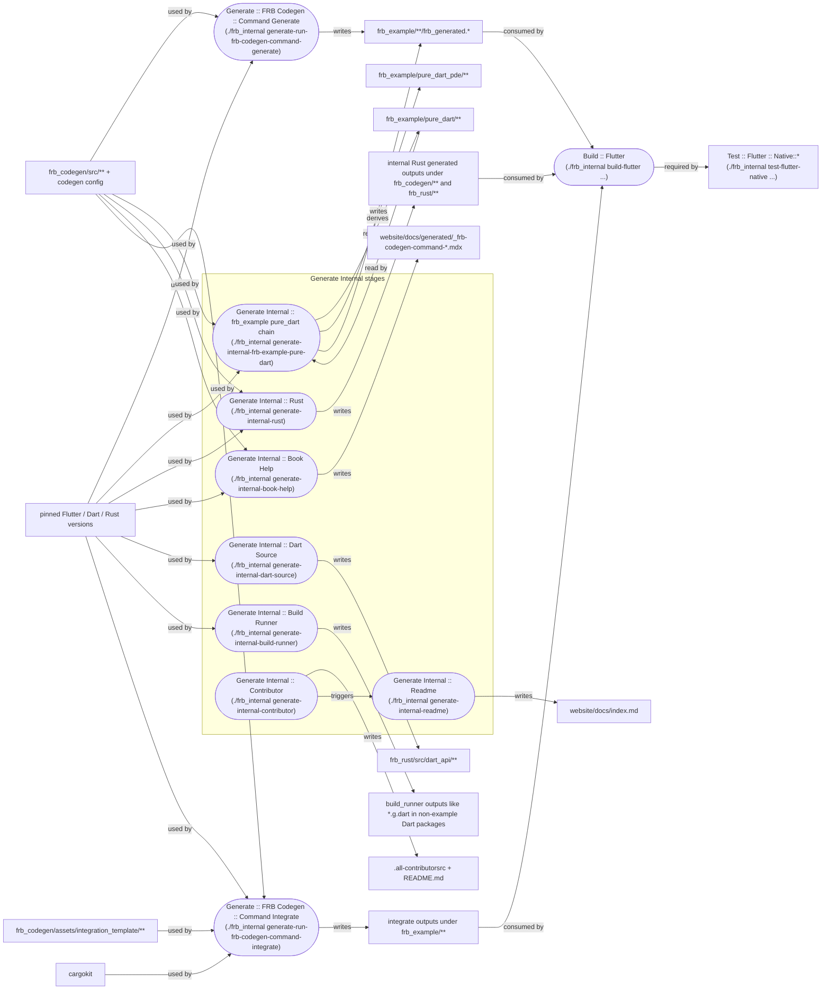

# FRB Fix CI

> **Note:** Check your user-level `remote-testing` rules before running commands. Tests and codegen may require remote execution.

## Overview

CI failures in flutter_rust_bridge often have simple fixes. Try the appropriate approach below before deep investigation.

**Core principle:** Start with lazy fixes (re-run, copy diff, --fix) before expensive investigation.

## Triage Order

Use this order before diving into individual failure types:

1. Check the latest relevant run or job first. Do not reason from stale CI state.
2. If the failure looks flaky, rerun only the failed jobs.
3. Reproduce the exact failing `./frb_internal ...` command from CI, but first check your user-level `remote-testing` rules instead of assuming local execution is correct.
4. Decide where the failure sits in the dependency graph: is it more likely a prerequisite cause (`Generate` / `Integrate` / `Generate Internal`) or a downstream symptom (`Build :: Flutter`, native tests)?
5. Only do deeper debugging after you have ruled out flakes, stale runs, and failure propagation.

### Checking the Right Run

Do not answer from stale CI state. Read the latest relevant run or job information first.

## Quick Reference

| Symptom | Fix |
|---------|-----|
| Flaky test (passes sometimes) | `gh run rerun --failed` |
| Git diff shown in CI | `git apply` OR regenerate |
| Lint/format errors | Add `--fix` flag |
| Can't reproduce locally | Use same `./frb_internal` command from CI, following `remote-testing` rules |

## Dependency Order

When several related jobs are failing, use this dependency graph instead of treating all failures as peers:

Legend: rectangles are files or directories. Ovals are CI operations. In each oval, the first line is the CI job name and the second line in parentheses is the corresponding `./frb_internal ...` command when there is one.



#### How to Read

Read the graph as artifact and input dependencies, not as a literal GitHub Actions job graph.

#### Key Chains

- `frb_codegen/assets/integration_template/` + `cargokit` -> integrate outputs under `frb_example/**`
  If Flutter integrate examples, example platform files, `Build :: Flutter`, and native Flutter tests regress together, suspect these template inputs first. Do not hand-edit generated example outputs.
- `Generate Internal` + `frb_example/pure_dart/**` -> `frb_example/pure_dart_pde/**`
  If `pure_dart_pde` is failing, do not only refresh `pure_dart_pde`. First check whether `./frb_internal generate-internal --set-exit-if-changed ...` is still changing `frb_example/pure_dart`.

#### When to Consult

Use this graph when several nearby categories start failing together in the same run, especially when earlier nodes such as `Generate`, `Integrate`, `generate-internal-frb-example-pure-dart`, or `generate-internal-rust` are already red and later failures look consistent with missing, stale, or mismatched generated files or platform files.

#### Rule

Prefer fixing prerequisite nodes before symptom nodes. If a prerequisite node is still unstable, treat later failures as propagated symptoms until proven otherwise. If this pattern keeps repeating across multiple commits or CI runs, jump to `Whack-a-Mole Prevention`.

## Whack-a-Mole Prevention

This section is about history across multiple commits or CI runs, not a single failing job.

Use it when the same area keeps becoming green and then red again, especially with commits like `refresh`, `regenerate`, `sync`, and `revert`.

What this usually means:

- You may be chasing generated outputs instead of fixing their source inputs
- A prerequisite node on the dependency graph is still unstable
- A temporary green run may only mean one symptom was suppressed, not that the root cause was fixed

What to do:

- Stop adding more generated-output-only sync commits by default
- Go back to the dependency graph and identify the unstable source of truth first: generation logic, templates, toolchain version, generation order, or package relationship
- Only accept regenerated outputs after that source node is stable in a clean matching environment

Common FRB patterns:

- Flutter integrate examples:
  suspect `frb_codegen/assets/integration_template/` and `cargokit`; do not hand-edit generated example outputs
- `pure_dart` and `pure_dart_pde`:
  if both are moving, stabilize `frb_example/pure_dart` first and treat `pure_dart_pde` as a dependent output

## Fixes by Failure Type

### Flaky Test

Sometimes CI fails due to timing issues, not real bugs. Rerun only failed jobs:

```bash
gh run rerun --failed
```

If it passes on retry -> flaky, not your bug.

### Git Diff Errors

When CI shows a diff, you have two options:

**Option A: `git apply` (faster)**

CI already ran the generator. Just apply what it computed:

```bash
# Copy the diff from CI, then:
pbpaste | git apply   # macOS
```

**Option B: Regenerate (slower but more "proper")**

```bash
./frb_internal precommit-generate
```

> **After codegen:** Check your user-level `remote-testing` rules. If codegen was run remotely, pull changes back to local.

Both are correct. Option A is faster; Option B is more thorough.

Do not hand-edit generated files as the final fix.

You may use CI diffs only as a diagnosis aid to understand what changed, but the final accepted output should come from re-running the appropriate generation workflow in a clean matching environment.

### Can't Reproduce Locally

CI shows the command it ran. Before running it, check your user-level `remote-testing` rules to determine whether this repo requires remote execution.

Before reproducing, make sure the toolchain versions match CI closely enough to be meaningful. In practice this usually means Flutter, Dart, Rust, cargo subcommands, and any pinned template or helper dependency should match the versions used by CI.

Then run the same command:

```bash
# CI shows: ./frb_internal test-dart --package frb_example/pure_dart
./frb_internal test-dart --package frb_example/pure_dart
```

### Lint/Format Errors

For clippy, dart analyze, or format errors, use `--fix`:

```bash
./frb_internal lint --fix
```

This runs:
- `cargo clippy --fix` - Rust lint fixes
- `cargo fmt` - Rust format
- `dart format` - Dart format
- `dart fix --apply` - Dart auto fixes

When lint/format failures happen on generated files, do not default to hand-editing those files just to match formatter output.

Instead:
- Compare the formatter inputs across branch head, PR merge ref, and remote workspace
- Check whether generation order, hidden generation steps, or toolchain/environment drift changed the generated file before formatter ran
- Only accept formatter output after confirming the pre-format generated input is actually the correct one

### `Command Integrate` Failures

When `Generate :: FRB Codegen :: Command Integrate` fails because integrated output is wrong, do not hand-edit the generated integrate example outputs.

Instead:
- Fix the source templates under `frb_codegen/assets/integration_template/`
- Re-run integrate generation after updating the templates

### Generate-caused Failures

If CI previously failed mainly in `Generate` while other jobs passed, and after accepting generated changes additional non-`Generate` jobs start failing, treat this as strong evidence that the accepted generated outputs are incorrect or incomplete.

In that situation:

- Do not continue fixing downstream failures one by one first
- First validate the generation logic or generation workflow
- Re-generate from a clean environment
- Only accept generated outputs after confirming they do not introduce new non-`Generate` regressions

### Dart Web Browser Startup Flakes

When `Test :: Dart :: Web (...)` fails after the web build and server startup already succeeded, and the failure is:

```text
Exception: Websocket url not found.
```

treat it as a likely browser / puppeteer startup flake first, not an immediate code regression.

In that situation:

- Do not assume the generated code or test logic is broken just from this error
- Check whether wasm build, `dart compile js`, and local web server startup already succeeded
- Prefer rerunning only the failed job first
- Only start code investigation if the same job keeps failing with the same error repeatedly

## Common Mistakes

- Investigating root cause when a simple re-run would work
- Not trying `git apply` first when CI provides a diff
- Fixing many new downstream test/build failures one by one after accepting generated changes, when CI previously failed mainly in `Generate`
- Hand-editing generated files to chase CI formatter output before checking whether CI, merge ref, and remote environments are formatting the same input
- Hand-editing integrate-generated example outputs instead of fixing `frb_codegen/assets/integration_template/`
- Chasing repeated `refresh/regenerate/sync` diffs without re-checking the upstream generation inputs
- Fixing downstream build/test jobs before upstream generate/integrate jobs are stable
- Answering from stale CI state instead of reading the latest relevant run or job information first

## Related Skills

- `frb-code-generation` - Which generation commands to run
- `frb-debugging` - Deep debugging when simple fixes don't work
