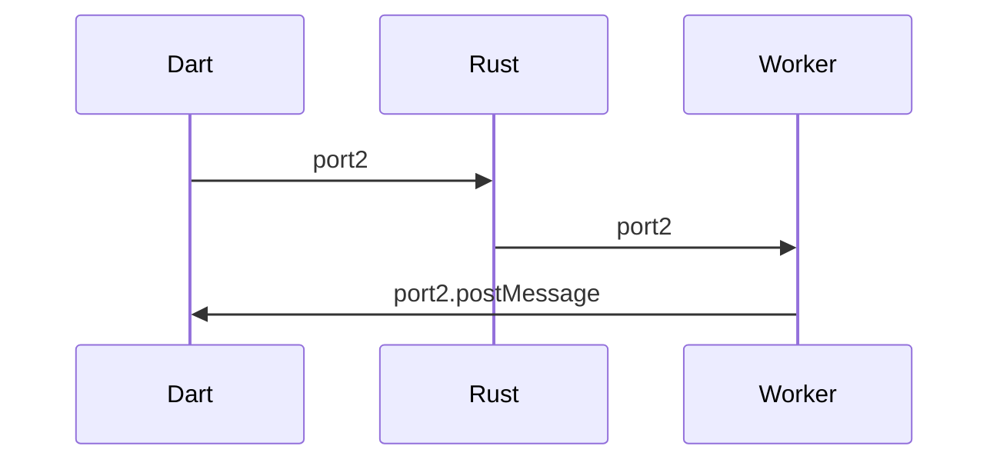
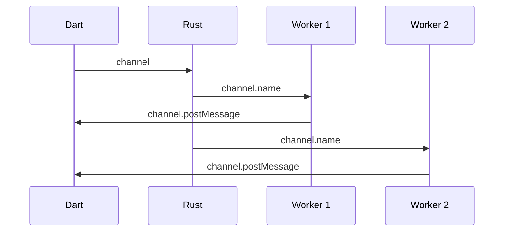

# Architecture

This document describes implementation details of this library.

## Terminology

**Rust Wire** types refers to the C types that the Dart VM uses to communicate with the Rust library.

**Dart Wire** types are the Dart counterpart of Rust wire types, but in
the `*.io.dart` files. Both Rust and Dart wire types communicate the
vocabulary of C types, aka primitives, structs, unions and pointers.

**Rust JS** (also WASM) types are the WASM equivalent of Rust wire
types, many of which are distinct from their C siblings. In addition,
these types may also take the form of the catch-all `JsValue`.

**Dart JS** types are the WASM equivalent of Dart wire types, but
different from Rust JS types most of these remain identical to their real API types.
Similar to the the relationship between Rust and Dart wire types, Rust JS and Dart JS's
uses the vocabulary of JavaScript types, aka primitives, arrays, typed arrays and objects.

## Type Mappings

Unless otherwise noted, `T` refers to a type from the same column or the generic type.
Does not include delegated types.

| Rust             | Rust Wire                | Dart Wire                | Rust JS                  | Dart JS            | Dart              |
| ---------------- | ------------------------ | ------------------------ | ------------------------ | ------------------ | ----------------- |
| `i{8..32}`       | `i{8..32}`               | `int`[^1]                | `i{8..32}`               | `int`              | `int`             |
| `u{8..32}`       | `u{8..32}`               | `int`[^1]                | `u{8..32}`               | `int`              | `int`             |
| `i64`            | `i64`                    | `int`                    | `BigInt`                 | `BigInt`           | `int`             |
| `u64`            | `u64`                    | `int`                    | `BigInt`                 | `BigInt`           | `int`             |
| `usize`          | `usize`                  | `int`                    | `usize`                  | `int`              | `int`             |
| `bool`           | `bool`                   | `bool`                   | `bool`                   | `bool`             | `bool`            |
| `Vec<i{8..32}>`  | `wire_int_{8..32}_list`  | `wire_int_{8..32}_list`  | `Box<[i{8..32}]>`        | `Int{8..32}Array`  | `Int{8..32}List`  |
| `Vec<u{8..32}>`  | `wire_uint_{8..32}_list` | `wire_uint_{8..32}_list` | `Box<[u{8..32}]>`        | `Uint{8..32}Array` | `Uint{8..32}List` |
| `Vec<i64>`       | `wire_int_64_list`       | `wire_int_64_list`       | `Box<[i64]>`             | `BigInt64Array`    | `Int64List`[^2]   |
| `Vec<u64>`       | `wire_uint_64_list`      | `wire_uint_64_list`      | `Box<[u64]>`             | `BigUint64Array`   | `Uint64List`[^2]  |
| `String`         | `wire_uint_8_list`       | `wire_uint_8_list`       | `String`                 | `String`           | `String`          |
| `Vec<String>`    | `wire_StringList`        | `wire_StringList`        | `Box<[String]>`          | `List`             | `List<String>`    |
| `Vec<T>`         | `wire_list_t`            | `wire_list_t`            | `Box<[JsValue]>`         | `List`             | `List<T>`         |
| `Box<T>`         | `*mut T`                 | `ffi.Pointer<T>`         | `Pointer<T>`[^3]         | `int`              | `T`               |
| `Option<T>`      | `*mut T`                 | `ffi.Pointer<T>`         | `Option<T>`              | `T?`               | `T?`              |
| `Option<Box<T>>` | `*mut T`                 | `ffi.Pointer<T>`         | `Option<Pointer<T>>`[^4] | `T?`               | `T?`              |
| enum/struct `T`  | `*mut wire_t`            | `ffi.Pointer<T>`         | `Array`                  | `List`             | class `T`         |
| enum `T`[^5]     | `int`                    | `int`[^1]                | `i32`                    | `int`              | enum `T`          |

## Cross-scope communication in Dart JS

On Web platforms, for lack of a proper `SendPort` there exists replacements from `dart:html`.

**MessagePort** replaces `dart:ffi`'s `SendPort` and is created from `MessageChannel`. The Dart
thread creates a channel, keeps the receive port to itself and transfers the send port to the workers.

**BroadcastChannel** replaces `dart:ffi`'s `SendPort` for `StreamSink`s, due to the fact that wasm_bindgen
keeps the ports in a JS-local scope that cannot be shared with other threads. A broadcast channel
is created by Dart, then passed to the main Rust thread. Rust then transfers its name to the workers.
When other workers refer to a `StreamSink` from another worker, e.g. if the sink was put in a static variable,
a new `BroadcastChannel` will be created from its name.

`BroadcastChannel`s are guaranteed to be unique for each invocation.[^6]

It is theoretically possible to have a one-to-one implementation of Isolate using only web primitives,
`BroadcastChannel`s and `Worker`s, but it remains to be seen how practical such an approach would be.

## Limitations of Rust WASM

- `panic::catch_unwind` does not currently work on the Web. When a Rust thread panics, it aborts and throws a
  JavaScript `RuntimeError` that cannot be caught by name in Dart. Right now, the implementation to
  catch these errors resides within the bodies of the workers, i.e. it is not straightforward enough to
  generalize for other use-cases.
- `Int64List` and `Uint64List` throws when used on Web platforms. They are left intentionally
  unimplemented by the Dart language developers, perhaps due to the differences between `int` and `BigInt`.
  This library provides a barebones shim that is missing many features, so please create an issue/PR if the shim
  is missing a function you need.
- Support for the various components of WASM is not universal among browsers. Here is a (non-exhaustive) list
  of trackers for how widely available some of the features are across browsers:
  - [`MessagePort` error events](https://caniuse.com/mdn-api_messageport_messageerror_event)
  - [`crossOriginIsolated`](https://caniuse.com/mdn-api_crossoriginisolated)
  - [Shared Array Buffers](https://caniuse.com/sharedarraybuffer)
  - [`BroadcastChannel`](https://caniuse.com/sharedarraybuffer)
  - [Atomics](https://caniuse.com/mdn-javascript_builtins_atomics)
  - [`BigInt64Array`](https://caniuse.com/mdn-javascript_builtins_bigint64array)
  - [WebAssembly](https://caniuse.com/wasm)
  - [WebAssembly roadmap](https://webassembly.org/roadmap/)
- Support for JavaScript runtimes (Node.js, Deno, etc.) is unimplemented, but should be straightforward enough.

[^1]: When behind a `ffi.Pointer`, they are their respective types from `dart:ffi`: `ffi.Int8`, `ffi.Int16`, etc.
[^2]:
    These types are unspported on Web by `dart:typed_list`, so this library provides a barebores shim over the JS native types.
    If you wish to use these types, replace all `dart:typed_list` imports with this library.

[^3]: The `Pointer` JS type is provisional and may be removed in the future.
[^4]: While `Option<*mut T>` would fit this better, as of writing wasm_bindgen does not support this type.
[^5]: Refers to C-style enums only (no fields).
[^6]: This is currently implemented as a monotonically-increasing index.
