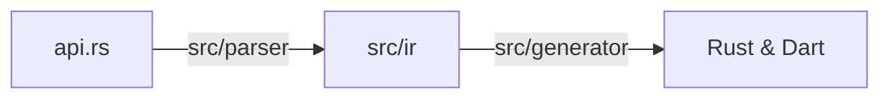
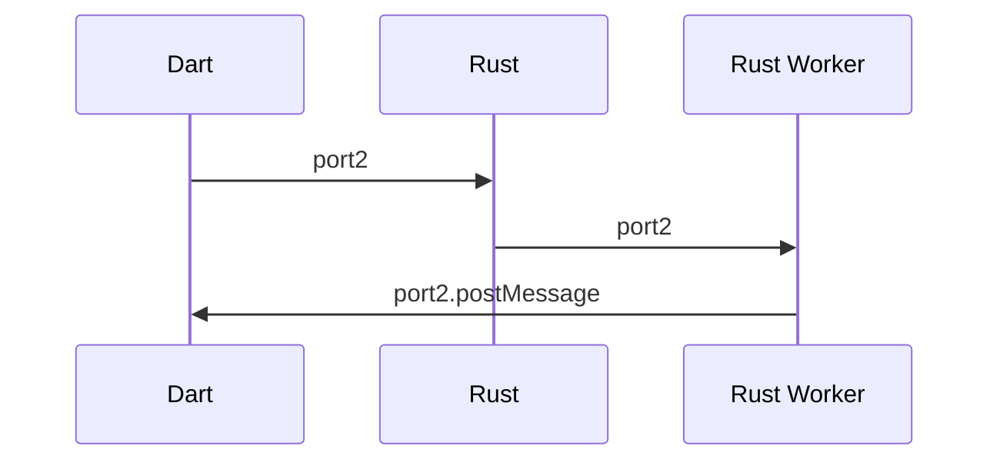
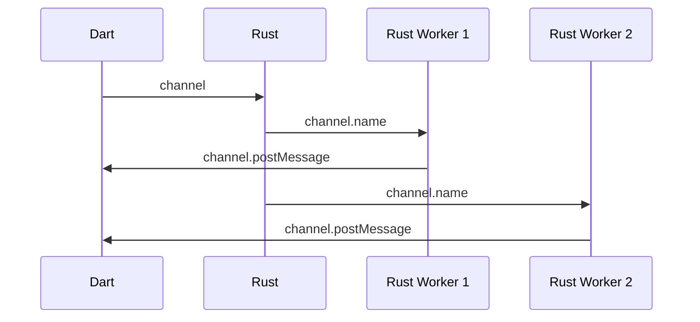

# Overall design

> This doc is still WIP. Tracking issue: https://github.com/fzyzcjy/flutter_rust_bridge/issues/593

## Folder structure

- `frb_codegen`: Code generator. It inputs `api.rs` and outputs Rust and Dart code files.
- `frb_example`: Examples.
  - `pure_dart`: Not only an example, but, more importantly, serves as end-to-end tests.
  - `with_flutter`: Example with integration into Flutter.
  - `pure_dart_multi`: Demonstrate multi-file usage.
- `frb_dart`: Support library for Dart - to be imported by users.
- `frb_rust`: Support library for Rust - to be imported by users.
- `frb_macros`: Indeed part of `frb_rust`. <small>It is a separate package simply because limitation of proc macros.</small>
- `book`: The documentation.
- `.github`: GitHub-related.
  - `workflows/ci.yaml`: Definition of CI workflows.

## Terminology

**Rust IO Wire** types refers to the C types the Dart VM uses to communicate with the Rust library.

**Dart IO Wire** types are the Dart counterpart of Rust IO wire types, but in
the `*.io.dart` files. Both Rust and Dart wire types communicate using the
vocabulary of C types, aka primitives, structs, unions and pointers.

**Rust JS Wire** types are the WASM equivalent of Rust IO
wire types, many of which are distinct from their C siblings.
In addition, these types may also take the form of the catch-all `JsValue`.

**Dart JS Wire** types are the WASM equivalent of Dart IO wire types, but
unlike Rust JS wire types, most of these types remain identical to their real API counterparts.
Similar to the the relationship between Rust IO and Dart IO wire types, Rust JS and Dart JS wire types
use the vocabulary of JavaScript types, aka primitives, arrays, typed arrays and objects.

## Code-generator structure

The pipeline is as follows:



- The input, `api.rs` in the figure, is the user-provided handwritten Rust code.
- The parser (`src/parser`) converts the input code (indeed [syn](https://crates.io/crates/syn) tree) into IR.
- IR (`src/ir`), or internal representation, is a data structure that represents the information of the code that we are interested in.
- The generator (`src/generator`) converts the IR into final outputs. More specifcially, as you can probably guess, `src/generator/dart` generates Dart code, `src/generator/rust` is for Rust code, and `src/generator/c` is for (a bit of) C code.
- The outputs (`Rust & Dart` in the figure) are written to corresponding files.

## Data flow

Let us see what happens when a function is called.

Suppose a user calls a (generated) Dart function `func({required String str})`. Then, the following happens:

1. The generated Dart function, `func({required String str})`, convert "_Dart api data_" (i.e. the data that user really provides) into "_Dart wire data_" (i.e. the data that will really pass between Dart and Rust). More specifically, it calls `_api2wire_String(str)` and get a `ffi.Pointer<wire_uint_8_list>` (because `String`s use `pub struct wire_uint_8_list { ptr: *mut u8, len: i32 }` under the hood).
2. Now we call the Dart version of `wire_func`, with low-level data like `wire_uint_8_list`. We have used our codegen to create a Rust `wire_func` function, and use `cbindgen` to generate the corresponding C function, and use `ffigen` to get the corresponding Dart function. Here, we call the Dart version of `wire_func`. Since Dart FFI and Rust FFI is C-compatible, it seamlessly calls the Rust version of `wire_func`. Notice that, since we are utilizing C-compatible functions (and it is the only feasible way), we can only pass around low-level things like pointers, instead of high-level and safe things.
3. Surely, the Rust `wire_func` is called. The function uses `.wire2api()` to convert "_Rust wire data_" (`wire_uint_8_list` here) into "_Rust api data_" (`String` here, i.e. data that users really use).
4. The `FLUTTER_RUST_BRIDGE_HANDLER` is called with "_Rust api data_". That handler is user-customizable, so users may provide their own implementation other than the default thread-pool, etc. By default, we use a thread pool, and we call the user-written `func` Rust function in `api.rs`.
5. The user-written `fn func(str: String) -> String { ... }` is called, and we get a return value.
6. The return value, a `String`, is posted to the Dart side. It is done by the Dart-provided API, [`Dart_PostCObject`](https://github.com/dart-lang/sdk/blob/fd0d3b254690007d0ebc84175f30fa7d7491ec3e/runtime/include/dart_native_api.h#L124), which let us provide C structs and it will automatically become Dart data on the other side. We use the Rust-safe wrapper `allo-isolate` for it. We deliberately choose this, because this enables Dart code to be _async_ instead of sync.
7. On the Dart side, we now see some Dart objects (indeed "_Dart wire data_"). We use functions like `_wire2api_SomeType` to convert it to the final "_Dart api data_". Notice this "wire2api" is on _Dart_ side, so it means "_Dart_ wire data to _Dart_ api data", and is different from the one above which is for Rust. For example, since `Dart_PostCObject` does not provide a way to construct arbitrary structs(classes), we have to pass Rust structs as lists, and use the `wire2api` to convert them to corresponding Dart classes.
8. The final result value is provided as return value of the Dart function, `func`, that the user called just now. A function call finishes!

## Type Mappings

Unless otherwise noted, `T` refers to a type from the same column or the generic type.
Does not include delegated types.

| Rust             | Rust IO Wire             | Dart IO Wire             | Rust JS Wire      | Dart JS Wire       | Dart              |
| ---------------- | ------------------------ | ------------------------ | ----------------- | ------------------ | ----------------- |
| `i{8..32}`       | `i{8..32}`               | `int`[^1]                | `i{8..32}`        | `int`              | `int`             |
| `u{8..32}`       | `u{8..32}`               | `int`[^1]                | `u{8..32}`        | `int`              | `int`             |
| `i64`            | `i64`                    | `int`                    | [`BigInt`]        | [`BigInt`]         | `int`             |
| `u64`            | `u64`                    | `int`                    | [`BigInt`]        | [`BigInt`]         | `int`             |
| `usize`          | `usize`                  | `int`                    | `usize`           | `int`              | `int`             |
| `bool`           | `bool`                   | `bool`                   | `bool`            | `bool`             | `bool`            |
| `Vec<i{8..32}>`  | `wire_int_{8..32}_list`  | `wire_int_{8..32}_list`  | `Box<[i{8..32}]>` | `Int{8..32}Array`  | `Int{8..32}List`  |
| `Vec<u{8..32}>`  | `wire_uint_{8..32}_list` | `wire_uint_{8..32}_list` | `Box<[u{8..32}]>` | `Uint{8..32}Array` | `Uint{8..32}List` |
| `Vec<i64>`       | `wire_int_64_list`       | `wire_int_64_list`       | `Box<[i64]>`      | [`BigInt64Array`]  | `Int64List`[^2]   |
| `Vec<u64>`       | `wire_uint_64_list`      | `wire_uint_64_list`      | `Box<[u64]>`      | [`BigUint64Array`] | `Uint64List`[^2]  |
| `String`         | `wire_uint_8_list`       | `wire_uint_8_list`       | `String`          | `String`           | `String`          |
| `Vec<String>`    | `wire_StringList`        | `wire_StringList`        | `Box<[String]>`   | `List`             | `List<String>`    |
| `Vec<T>`         | `wire_list_t`            | `wire_list_t`            | `Box<[JsValue]>`  | `List`             | `List<T>`         |
| `Box<T>`         | `*mut T`                 | `ffi.Pointer<T>`         | `T`               | `T`                | `T`               |
| `Option<T>`      | `*mut T`                 | `ffi.Pointer<T>`         | `Option<T>`       | `T?`               | `T?`              |
| `Option<Box<T>>` | `*mut T`                 | `ffi.Pointer<T>`         | `Option<T>`       | `T?`               | `T?`              |
| enum/struct `T`  | `*mut wire_t`            | `ffi.Pointer<T>`         | `Array`           | `List`             | class `T`         |
| enum `T`[^3]     | `i32`[^5]                | `int`[^1]                | `i32`[^5]         | `int`              | enum `T`          |
| [`DartAbi`]      | [`DartCObject`]          | `dynamic`                | [`JsValue`]       | `dynamic`          | `dynamic`         |

## Memory safety

How is memory safety implemented? This is a case-by-case problem. For example, suppose we want to see how a `String` is safely passed from Dart to Rust. Then, we need to examine the Dart `_api2wire_String` and the Rust `.wire2api()` for it.

Indeed `String` is implemented by delegating to `Vec<u8>`, so we need to see code related to String as well as `Vec<u8>`. By simply clicking a few times and jump around code, we will see that:

```dart
ffi.Pointer<wire_uint_8_list> _api2wire_String(String raw) {
  return _api2wire_uint_8_list(utf8.encoder.convert(raw));
}

ffi.Pointer<wire_uint_8_list> _api2wire_uint_8_list(Uint8List raw) {
  final ans = inner.new_uint_8_list_0(raw.length);
  ans.ref.ptr.asTypedList(raw.length).setAll(0, raw);
  return ans;
}
```

and

```rust,noplayground
impl Wire2Api<Vec<u8>> for *mut wire_uint_8_list {
    fn wire2api(self) -> Vec<u8> {
        unsafe {
            let wrap = support::box_from_leak_ptr(self);
            support::vec_from_leak_ptr(wrap.ptr, wrap.len)
        }
    }
}

impl Wire2Api<String> for *mut wire_uint_8_list {
    fn wire2api(self) -> String {
        let vec: Vec<u8> = self.wire2api();
        String::from_utf8_lossy(&vec).into_owned()
    }
}

pub struct wire_uint_8_list {
    ptr: *mut u8,
    len: i32,
}
```

In other words, String (or `Vec<u8>`) is converted to a raw struct with pointer and length field. The memory is manipulated carefully so there is no leak or double free.

We use Valgrind to check as well, and I use it in production environment without problems, so no worries about memory problems :)

## Dart bridge hierarchy

A bridge module consists of several classes:

- One `_Impl` class implementing the wire functions and common helpers; and
- One or more `_Platform` classes implementing the platform-specific helpers.

The implementor class takes a platform class as a private attribute, and the platform
class exposes all of its members decorated with `@protected`. The specific platform class
to be used is gated by conditional imports.

## Cross-scope communication in the browser

On Web platforms, for lack of a proper `SendPort` there exists replacements from `dart:html`.

**MessagePort** replaces `dart:ffi`'s `SendPort` and is created from `MessageChannel`. The Dart
thread creates a channel, keeps the receive port and transfers the send port to the workers.



**BroadcastChannel** replaces `dart:ffi`'s `SendPort` for `StreamSink`s, due to the fact that wasm_bindgen
keeps the ports in a JS-local scope that cannot be shared with other threads. A broadcast channel
is created by Dart, then passed to the main Rust thread. Rust then transfers its name to the workers.
When other workers refer to a `StreamSink` from another worker, e.g. if the sink was put in a static variable,
a new `BroadcastChannel` will be created from its name.

`BroadcastChannel`s are guaranteed to be unique for each invocation.[^4]



It is theoretically possible to have a one-to-one implementation of Isolate using only web primitives,
`BroadcastChannel`s and `Worker`s, but it remains to be seen how practical such an approach would be.

## OptionalList

Per the implementation, most IRs are also accompanied by a List type (GeneralList, PrimitiveList, StringList etc.)
each of which handles lists in different ways. When Optional was first implemented, it relied on GeneralList since the
underlying assumption that Optional already boxed stack values should allow for seamless interaction. Howver, this became an issue
later because other IRs would have to accommodate for Optionals instead of being perfectly encapsulated, leading to
ugly hacks. [#1388](https://github.com/fzyzcjy/flutter_rust_bridge/pull/1388) introduced OptionalList to bring
Optional in line with other IRs, and is implemented as a list of maybe-null pointers. It does highlight several drawbacks
to this approach to IRs where specializations shine compared to GeneralList.

1. GeneralList requires a fully-allocated list and asks the Dart side to _fill_ in the blanks via `api_fill` functions, but these
   are not implemented by any delegates since they all have their own special lists (StringList, TimeList, Uuids). This renders
   types like `List<String?>` difficult to implement without hacks.
2. OptionalList's inner pointer is a `*mut *mut T`, which without significant refactoring would be difficult to represent with
   GeneralList, and whose typical usage doesn't really require double indirection often enough to justify it.
3. OptionalList enables future optimizations, for example the case when `sizeof(T) <= sizeof(usize)`, which would certainly be difficult
   to accomplish with GeneralList.

## Want to know more? Tell me

What do you want to know? Feel free to create an issue in GitHub, and I will tell more :)

[^1]: When behind a `ffi.Pointer`, they are their respective types from `dart:ffi`: `ffi.Int8`, `ffi.Int16`, etc.
[^2]:
    These types are unsupported on Web by `dart:typed_list`, so this library provides a barebores shim over the JS native types.
    If you wish to use these types, replace all `dart:typed_list` imports with this library.

[^3]: Refers to C-style enums only (no fields).
[^4]: This is currently implemented as a monotonically-increasing index.
[^5]: Enums may also specify a `#[repr]`, which is planned to be implemented.

[`bigint`]: https://developer.mozilla.org/en-US/docs/Web/JavaScript/Reference/Global_Objects/BigInt
[`bigint64array`]: https://developer.mozilla.org/en-US/docs/Web/JavaScript/Reference/Global_Objects/BigInt64Array
[`biguint64array`]: https://developer.mozilla.org/en-US/docs/Web/JavaScript/Reference/Global_Objects/BigUint64Array
[`dartabi`]: https://docs.rs/flutter_rust_bridge/latest/flutter_rust_bridge/ffi/type.DartAbi.html
[`dartcobject`]: https://docs.rs/flutter_rust_bridge/latest/flutter_rust_bridge/ffi/io/ffi/struct.DartCObject.html
[`jsvalue`]: https://rustwasm.github.io/wasm-bindgen/reference/types/jsvalue.html

<script src="https://cdn.jsdelivr.net/npm/mermaid/dist/mermaid.min.js"></script>
<script>
let mdbookTheme = localStorage.getItem("mdbook-theme") || default_theme;
mermaid.initialize({
    startOnLoad: true,
    theme: mdbookTheme == 'light' || mdbookTheme == 'rust' ? 'light' : 'dark',
});
</script>
