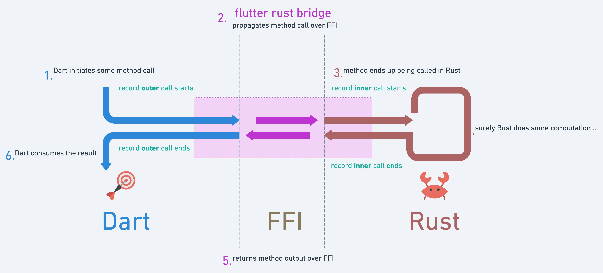

# Benchmarks

Let's explore how to implement your custom benchmark logic with `flutter_rust_bridge` (or "`FRB`" for conciseness).

## overview

Simply put, we're going to implement a custom interceptor to benchmark our function calls made over FFI with FRB. It will record time on both outer Dart call and subsequent inner Rust call.

To make it even more interesting, we'll provide a way to feed in some CLI arg to alternate between 2 different outputs:

- by default, benchmarks will be traced to stdout in real time
- alternatively, if provided with a `JSON=true` arg, benchmarks will be output at once in JSON (useful for CI automation)

### platform-specific considerations

As you'll notice if you venture into the codebase (which I encourage you to), this does require a fair share of platform-specific code, so here's the summary:

#### data types

We need to represent time:

|                                                               | :dart: Dart        | :crab: Rust        |
| -----------                                                   | -----------        | -----------        |
| :desktop_computer: :computer: :iphone: native platforms       | `int`                | `u64`                |
| :globe_with_meridians: web platform                           | `BigInt`             | `u64`                |

And use the smallest unit of time provided wherever our code run:

|                                                               | :dart: Dart        | :crab: Rust        |
| -----------                                                   | -----------        | -----------        |
| :desktop_computer: :computer: :iphone: native platforms       | *microseconds*                | *nanoseconds*                |
| :globe_with_meridians: web platform                           | *milliseconds*             | *nanoseconds*                |

#### packages

To make our life easier, we'll leverage existing packages and crates.

|                                                               | :dart: Dart           | :crab: Rust                                 |
| -----------                                                   | -----------           | -----------                                 |
| :desktop_computer: :computer: :iphone: native platforms       | `logging` + `Stopwatch`   | `tracing` + `Instant`                           |
| :globe_with_meridians: web platform                           | `window.performance`    | `web_sys` + `wasm_bindgen` + `js_sys` + `chrono`             |

## Howto

### :crab: on Rust side

Basically `flutter_rust_bridge` already offers a way to "plug" code anytime flutter rust bridge handles any function calls over FFI, a little bit like a middleware.

It comes out-of-the-box with its [DefaultHandler](http://cjycode.com/flutter_rust_bridge/feature/handler.html),
but also offers 2 ways to customize it.

The easiest one is to simply:

- create a new type for FRB [Handler](http://cjycode.com/flutter_rust_bridge/feature/handler.html)
  e.g. `pub type BenchHandler = SimpleHandler<BenchExecutor, BenchErrorHandler>;` in this example
- create a `BenchExecutor` and a `BenchErrorHandler`, as required by `SimpleHandler` trait bounds
- implement `Executor` trait for your executor

:bulb: platform-specific compilation is required for WASM only :bulb:

e.g. `#[cfg(target_family = "wasm")]`.

### :dart: on Dart side

Boilerplate code generated by FRB codegen ultimately creates a native dynamic library / WASM binary and exposes its method to open it, thus allowing for custom platform-agnostic implementation.

In this example the code is a bit more convoluted since benchmarking relies on recording time, and the primitive types and dart packages used in the process are mostly platform-specific as stated above.

The classic way is to:

- create a platform-agnostic way to record metrics
  e.g. `Interceptor`
- override FRB dynamic library implementation to consume the interceptor
  e.g. `FlutterRustBridgeExampleBenchmarkSuiteImplBench`
- override FRB Platform to provide platform-specific implementations
- create a method to open your previously created custom FRB dynamic library implementation
  e.g. `initializeBenchExternalLibrary`

:bulb: platform-specific code for Dart can be provided by implementing a platform-agnostic generic implementation and separate files for platform-specific (native and web) details. :bulb:

e.g. `interceptor.dart` (platform-agnostic), `interceptor.io.dart` (native platforms) and `interceptor.web.dart` (web platform).

## Troubleshooting

There's a couple of interesting bugs that one might face while implementing it.

### on Dart side

- on web platform, cli args parameters in Dart **must** use `-D` syntax.
  :speech_balloon: see [#44562](https://github.com/dart-lang/sdk/issues/44562)
  as a side note it's good to keep in mind that e.g. `dart run` uses `-D` or `--define`,
  but `--dart-define` is used with `flutter run` to pipe args down to dart
- dynamic library **must** be opened with [open](https://api.dart.dev/stable/2.6.1/dart-ffi/DynamicLibrary/DynamicLibrary.open.html) for some MacOS users and **only** on native platform builds.
  :sunglasses: a fix is provided:
  simply add `--define=SILICON=true` to your `dart run` command
- syntax to retrieve env vars is somehow inconsistent across native and web, sometimes returning empty values.
  :speech_balloon: see [#27998](https://github.com/dart-lang/sdk/issues/27998) and others
  :sparkles: but `frb_dart` can [handle it](https://github.com/fzyzcjy/flutter_rust_bridge/tree/master/frb_dart/lib/src/env) for you.
  :warning: in some case you might end up defining an env var which have to be `const` on one platform, while being `final` on the others: in this specific case, you might want to use dart `show`/`hide` import feature to convey your intent to the compiler when declaring your `import`.

### on Rust side

- at least at the time of the writing, some dependencies versions must be pin-pointed.
  :eye: see Cargo manifest for `chrono`, `web_sys`, `js_sys` and `wasm-bindgen`

### and WASM too

- env var cannot be accessed from WASM in the browser.
  :speech_balloon: see [#5737](https://github.com/bevyengine/bevy/discussions/5737#discussioncomment-3428966)
  env vars can be turned into cli args though, which WASM takes happily :wink:

## Final note

Finally, there's other ways to benchmark for you to explore too.

During development, [TimelineTask](https://api.flutter.dev/flutter/dart-developer/TimelineTask-class.html) (for normal async functions) and [Timeline](https://api.flutter.dev/flutter/dart-developer/Timeline-class.html) (for sync functions) were previously implemented (but I doubt you want to search through a 200-commits-long PR, do you? :sweat_smile:): it can be a good alternative, especially if you enjoy interactively working with [Dart DevTools](https://docs.flutter.dev/development/tools/devtools/performance).
