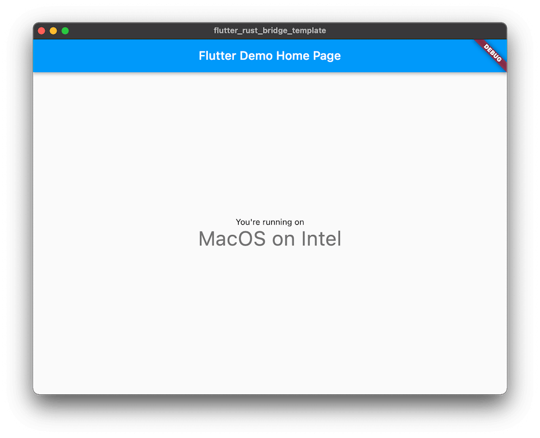

# Wrapping up

With our new definition of `Platform` in place, we can rewrite the previous code to make use
of it! Here is an example of what you can do with freezed enums.

In `lib/main.dart`:
```diff
 if (snap.data != null) {
-    final text = const {
-        Platform.Ios: 'iOS',
-        Platform.Windows: 'Windows',
-        Platform.Android: 'Android',
-        Platform.Unix: 'Unix',
-        Platform.MacApple: 'MacOS with Apple Silicon',
-        Platform.MacIntel: 'MacOS',
-        Platform.Wasm: 'the Web'
-    }[snap.data]!;
+    final text = snap.data!.when(
+        ios: () => 'iOS',
+        windows: () => 'Windows',
+        android: () => 'Android',
+        unix: () => 'Unix',
+        macOs: (arch) => 'MacOS on $arch',
+        wasm: () => 'the Web',
+        unknown: () => 'Unknown OS',
+    );
     ..
 }
```

In `native/src/api.rs`:

```diff
     } else if cfg!(target_os = "ios") {
         Platform::Ios
     } else if cfg!(target_arch = "aarch64-apple-darwin") {
-        Platform::MacApple
+        Platform::MacOs("Apple Silicon".into())
     } else if cfg!(target_os = "macos") {
-        Platform::MacIntel
+        Platform::MacOs("Intel".into())
     } else if cfg!(target_family = "wasm") {
         Platform::Wasm
     } else if cfg!(unix) {
```

When you `flutter run`, you should get something like this:
