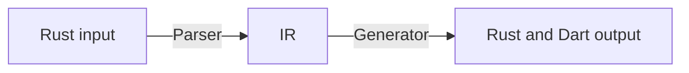
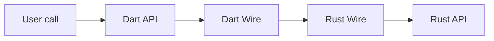

# Overview

## Prelude

Firstly, welcome, and thanks for your contributions!

If you want to contribute, feel free to create a [Pull Request](https://github.com/fzyzcjy/flutter_rust_bridge/pulls). If you need some ideas of what to contribute, have a look at the [Issues section](https://github.com/fzyzcjy/flutter_rust_bridge/issues) of this repository.

For a checklist, have a look at the [PR template](https://github.com/fzyzcjy/flutter_rust_bridge/blob/master/.github/PULL_REQUEST_TEMPLATE.md).

## Want to know more? Tell me

What do you want to know? Feel free to create an issue in GitHub, and I will tell more :)

## Main components and phases

There are two phases:

1. **Code generation**:
When user runs `flutter_rust_bridge_codegen generate`,
inputs are parsed and Rust/Dart code are automatically generated.
   * Corresponding components: `frb_codegen`
2. **Running**:
When user runs the app,
the generated code works together with runtime code.
   * Corresponding components: `frb_dart`, `frb_rust`

## Directory structure

:::tip

There is no need to read it word by word, since it serves as a reference to find the related directories.

:::

- `frb_codegen` (`flutter_rust_bridge_codegen` binary): Code generator. It inputs Rust files and generates Rust and Dart files.
- `frb_example`: Examples.
    - `pure_dart`: A pure-Dart example + contains most tests.
    - `dart_minimal`: Minimalist pure-Dart example. Suitable as a playground.
    - `flutter_via_create` / `flutter_via_integrate`: Examples automatically generated via `flutter_rust_bridge_codegen create/integrate`.
    - `deliberate_bad`: Deliberately buggy code to check sanitizers catch them.
- `frb_dart` (`flutter_rust_bridge` Dart package): Support library for Dart - to be imported by users.
- `frb_rust` (`flutter_rust_bridge` Rust package): Support library for Rust - to be imported by users.
- `frb_macros`: Indeed part of `frb_rust`. <small>It is a separate package simply because limitation of proc macros.</small>
- `frb_utils`: Utilities that may be published later.
- `tools/frb_internal`: Internal utilities for development of this library.
- `website`: The documentation.
- `.github`: GitHub-related.
    - `workflows/ci.yaml`: Definition of CI workflows.

## Code generator overview

:::tip

There seems to be a lot of files in `frb_codegen`,
but that is because I choose to modularize and keep each file focused and minimal.

:::

When someone runs `flutter_rust_bridge_codegen generate`, the workflow is as follows:

- The input is the user-provided handwritten Rust code, usually user's `rust/src/api/**` folder.
- The parser converts the input code into IR (intermediate representations).
- IR is a data structure that represents the information of the code that we are interested in.
- The generator converts the IR into final outputs.
- The outputs are written to corresponding files.
- Remark: There are also `preparer` (to prepare environments) and `polisher` (to do postprocessing).

The **generator** part is naturally splitted into:

* `api_dart`: Generate direct user-facing files,
like [this one](https://github.com/fzyzcjy/flutter_rust_bridge/blob/master/frb_example/flutter_via_create/lib/src/rust/api/simple.dart).
It is very thin, and forwards all function calls to the wire.
* `wire/rust`, `wire/dart`, `wire/c`: Generate the actual work to communicate between Rust and Dart,
i.e. `frb_generated*.dart` and `frb_generated*.rs`.

## The story of a function call

:::info Hint

The `frb_example/dart_minimal` sample is useful when you want to look at the generated code,
since it only has one function so the generated code is very short.

:::

Consider a very simple Rust function
`fn f(arg: String) {}`
called in Dart
(`await f(arg: 'Hello')`).
What happens under the hood during the function call?

In short, the user call invokes the Dart API layer, then Dart Wire layer, then Rust Wire layer,
and finally Rust API layer.
Then the reverse happens to pass the return value back to Dart.

If you want to know more details, here is a table.
(Code are adapted to ease understanding, thus it does not reflect actual details.)

| Name      | Sample Location                                                        | Sample code                                                       | Source        |
|-----------|------------------------------------------------------------------------|-------------------------------------------------------------------|---------------|
| User call | `lib/main.dart`                                                        | `print(f('Hello'));`                                              | User provided |
| Dart API  | `lib/src/rust/api/minimal.dart`, `lib/src/rust/frb_generated.dart` | `void f(String arg) => wire_f(codec.encode(arg))`                 | Generated     |
| Dart Wire | `lib/src/rust/frb_generated.dart`                                      | `void wire_f(char* ptr, int len); /* extern function */`          | Generated     |
| Rust Wire | `rust/src/frb_generated.rs`                                            | `fn wire_f(ptr: *mut u8, len: i32) { f(codec.decode(ptr, len)) }` | Generated     |
| Rust API  | `rust/src/api/minimal.rs`                                              | `fn f(arg: String) { user_code }`                                 | User provided |

More details are discussed in the concrete submodules, [CST codec](submodules/cst-codec) and [DCO codec](submodules/dco-codec).

## The codec

:::info
If you want to add a feature, there is **no need** to implement for all codecs.
If you like, you can only implement for one codec.
:::

During the function call, codecs are used to convert between normal Dart/Rust data
and the corresponding Dart/Rust "wire" data.
Currently, we have three codecs. A brief introduction is in [this page](../miscellaneous/codec).

Therefore, if you see modules named `cst`, `dco`, `sse`, they correspond to the codecs.
