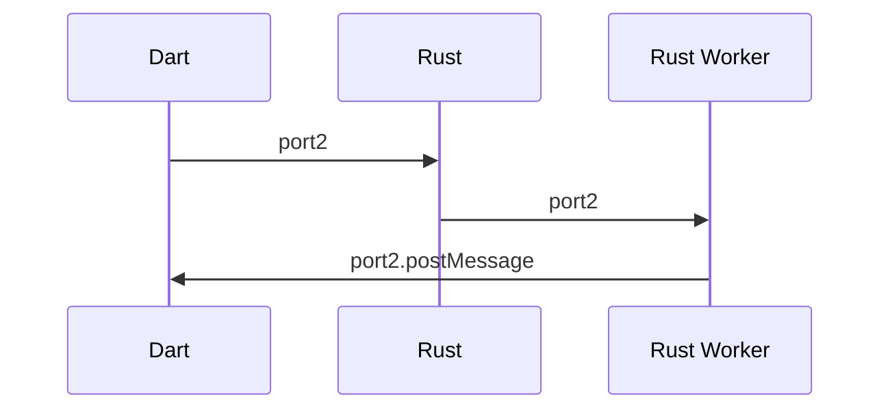
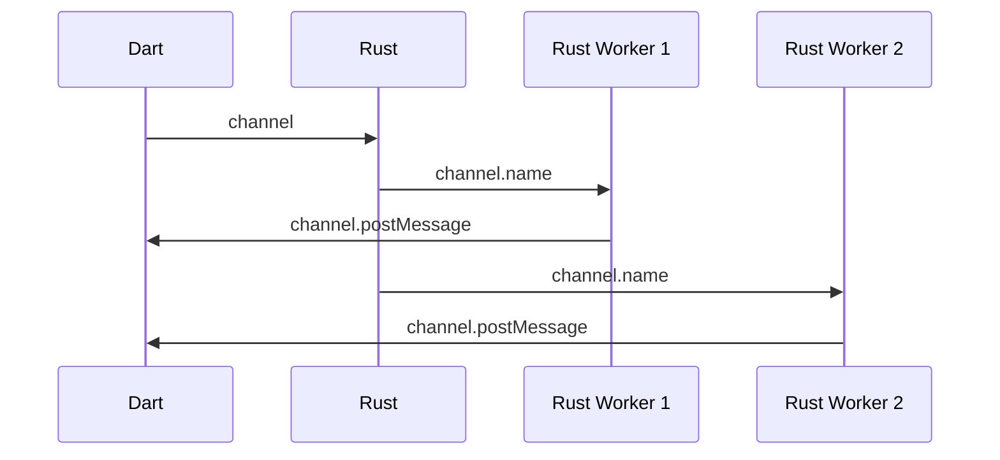

# DCO Codec

## More about function call example

Continue from the CST codec function call story,
the user's Rust function is already executed,
and our job here is to pass the return value back to Dart.

1. The return value, a `String`, is posted to the Dart side. It is done by the Dart-provided API, [`Dart_PostCObject`](https://github.com/dart-lang/sdk/blob/fd0d3b254690007d0ebc84175f30fa7d7491ec3e/runtime/include/dart_native_api.h#L124), which let us provide C structs and it will automatically become Dart data on the other side. We use the Rust-safe wrapper `allo-isolate` for it. We deliberately choose this, because this enables Dart code to be _async_ instead of sync.
2. On the Dart side, we now see some Dart objects (indeed "_Dart wire data_"). We use functions like `_wire2api_SomeType` to convert it to the final "_Dart api data_". Notice this "wire2api" is on _Dart_ side, so it means "_Dart_ wire data to _Dart_ api data", and is different from the one above which is for Rust. For example, since `Dart_PostCObject` does not provide a way to construct arbitrary structs(classes), we have to pass Rust structs as lists, and use the `wire2api` to convert them to corresponding Dart classes.
3. The final result value is provided as return value of the Dart function, `func`, that the user called just now. A function call finishes!

## Cross-scope communication in the browser

On Web platforms, for lack of a proper `SendPort` there exists replacements from `dart:html`.

**MessagePort** replaces `dart:ffi`'s `SendPort` and is created from `MessageChannel`. The Dart
thread creates a channel, keeps the receive port and transfers the send port to the workers.

**BroadcastChannel** replaces `dart:ffi`'s `SendPort` for `StreamSink`s, due to the fact that wasm_bindgen
keeps the ports in a JS-local scope that cannot be shared with other threads. A broadcast channel
is created by Dart, then passed to the main Rust thread. Rust then transfers its name to the workers.
When other workers refer to a `StreamSink` from another worker, e.g. if the sink was put in a static variable,
a new `BroadcastChannel` will be created from its name.

`BroadcastChannel`s are guaranteed to be unique for each invocation.[^1]

It is theoretically possible to have a one-to-one implementation of Isolate using only web primitives,
`BroadcastChannel`s and `Worker`s, but it remains to be seen how practical such an approach would be.

[^1]: This is currently implemented as a monotonically-increasing index.
