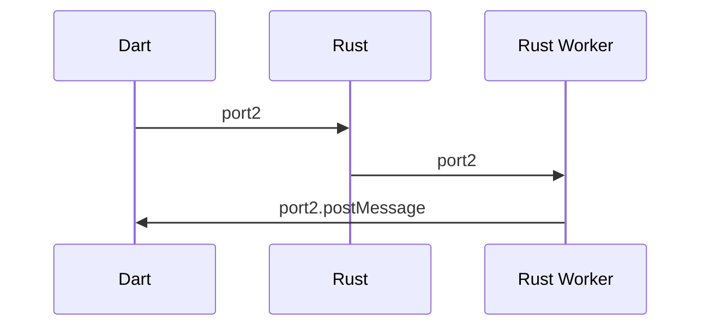
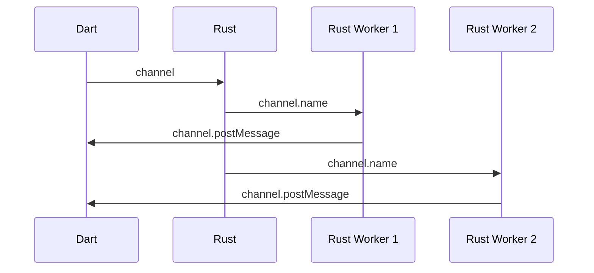

# DCO Codec

## More about function call example

Continue from the CST codec function call story,
the user's Rust function is already executed,
and our job here is to pass the return value back to Dart.

1. The return value, a `String`, is posted to the Dart side. It is done by the Dart-provided API, [`Dart_PostCObject`](https://github.com/dart-lang/sdk/blob/fd0d3b254690007d0ebc84175f30fa7d7491ec3e/runtime/include/dart_native_api.h#L124), which let us provide C structs and it will automatically become Dart data on the other side. We use the Rust-safe wrapper `allo-isolate` for it. We deliberately choose this, because this enables Dart code to be _async_ instead of sync.
2. On the Dart side, we now see some Dart objects (indeed "_Dart wire data_"). We use functions like `_wire2api_SomeType` to convert it to the final "_Dart api data_". Notice this "wire2api" is on _Dart_ side, so it means "_Dart_ wire data to _Dart_ api data", and is different from the one above which is for Rust. For example, since `Dart_PostCObject` does not provide a way to construct arbitrary structs(classes), we have to pass Rust structs as lists, and use the `wire2api` to convert them to corresponding Dart classes.
3. The final result value is provided as return value of the Dart function, `func`, that the user called just now. A function call finishes!

## Cross-scope communication in the browser

On Web platforms, for lack of a proper `SendPort` there exists replacements from `dart:html`.

**MessagePort** replaces `dart:ffi`'s `SendPort` and is created from `MessageChannel`. The Dart
thread creates a channel, keeps the receive port and transfers the send port to the workers.

```mermaid
sequenceDiagram
Dart ->> Rust: port2
Rust ->> Rust Worker: port2
Rust Worker ->> Dart: port2.postMessage
```

**BroadcastChannel** replaces `dart:ffi`'s `SendPort` for `StreamSink`s, due to the fact that wasm_bindgen
keeps the ports in a JS-local scope that cannot be shared with other threads. A broadcast channel
is created by Dart, then passed to the main Rust thread. Rust then transfers its name to the workers.
When other workers refer to a `StreamSink` from another worker, e.g. if the sink was put in a static variable,
each worker creates a `BroadcastChannel` from its name on first use and reuses that channel for subsequent
sends. Before the first worker-local batch is posted, Rust waits for Dart to acknowledge a readiness probe;
subsequent sends use the ready channel directly. Rust attaches a shared sequence number to every message, and Dart buffers
messages until the next sequence arrives. This preserves data, error, and close ordering even when different
workers send them.
The Dart ordering layer uses a synchronous stream transformer so pause and resume propagate directly to
the underlying browser channel subscription without waiting for another message.
If a send fails, Rust carries its skipped sequence numbers on the next message so later messages do not
remain buffered behind an event that will never arrive. A failed final close is retried through a fresh
channel.
When the last Rust `StreamSink` clone is dropped, Rust marks the ordered stream-close message for release.
After Dart has received all preceding messages and reaches that close, it broadcasts an acknowledgement.
Each worker then removes the channel from its local cache and closes the underlying channel.
Dart also closes both local `BroadcastChannel` objects owned by the receive port.
Waiting for Dart's acknowledgement prevents cleanup on one worker from discarding a message
that another worker has already posted but the browser has not delivered yet.
If Dart cancels the stream before receiving the close, cancellation completes for the consumer immediately
while the ordered browser subscription keeps draining in the background. Reaching the close then sends the
same acknowledgement and safely releases every worker-local cache without exposing later events to the
canceled consumer.

`BroadcastChannel`s are guaranteed to be unique for each invocation.[^1]

```mermaid
sequenceDiagram
Dart ->> Rust: channel
Rust ->> Rust Worker 1: channel.name
Rust Worker 1 ->> Dart: channel.postMessage
Rust ->> Rust Worker 2: channel.name
Rust Worker 2 ->> Dart: channel.postMessage
```

It is theoretically possible to have a one-to-one implementation of Isolate using only web primitives,
`BroadcastChannel`s and `Worker`s, but it remains to be seen how practical such an approach would be.

[^1]: This is currently implemented as a random page-session nonce plus a monotonically-increasing index.
