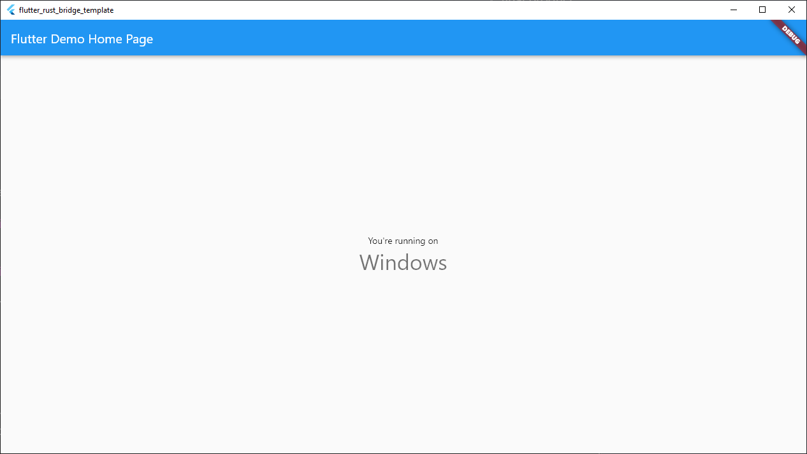

# Template tour

Congratulations! 🎉 You should have a working Flutter app equipped with
a Rust runtime component. This section is meant to be a gentle introduction to the details of Rust integration with the existing Flutter toolchain. Feel free to skip forward to [Generating code](generate) to learn how to write new code, or visit
[Integrating with existing projects](../existing) to add Rust to your preexisting Flutter project.
